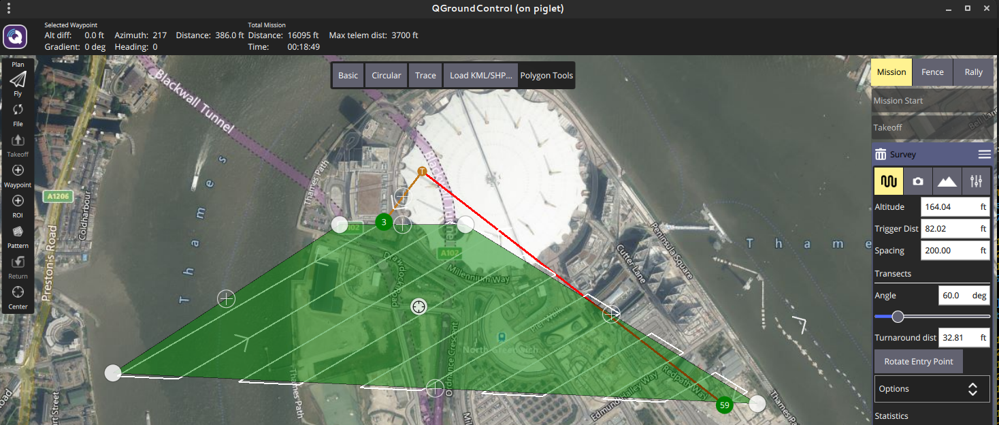
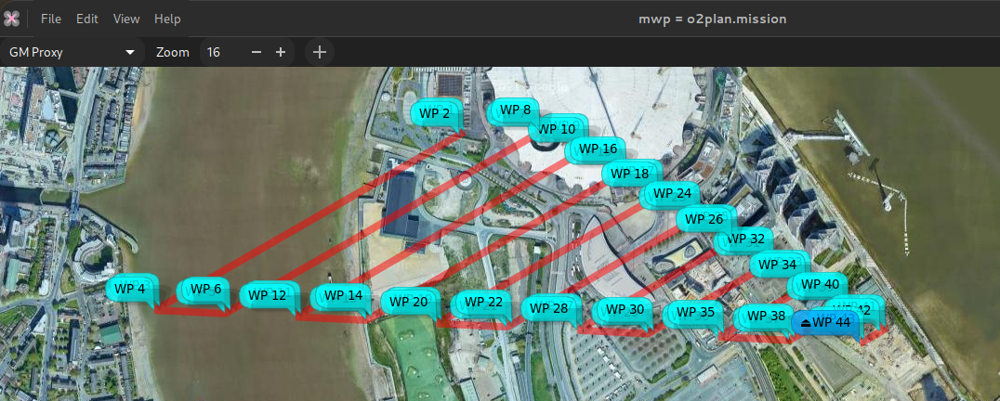
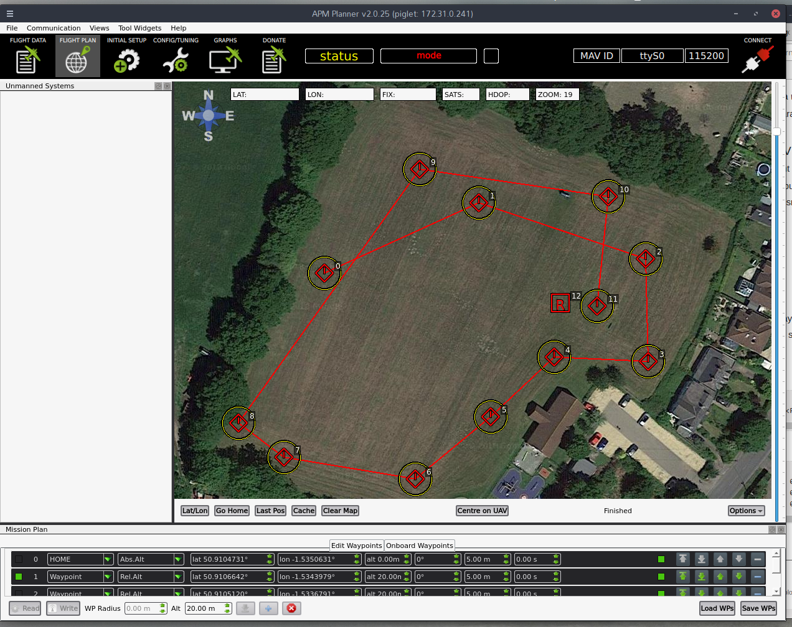
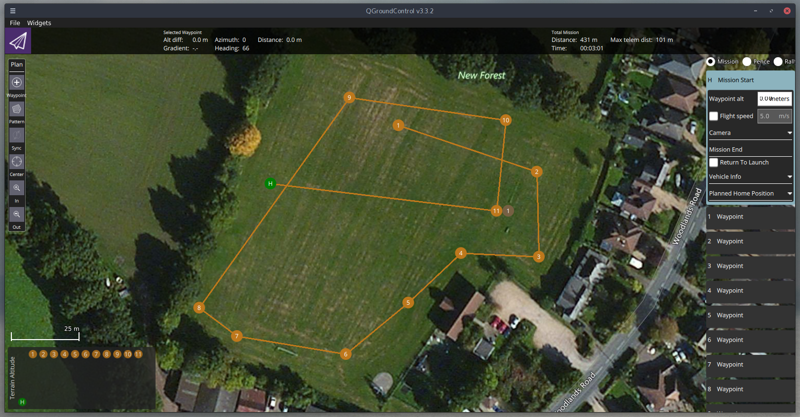
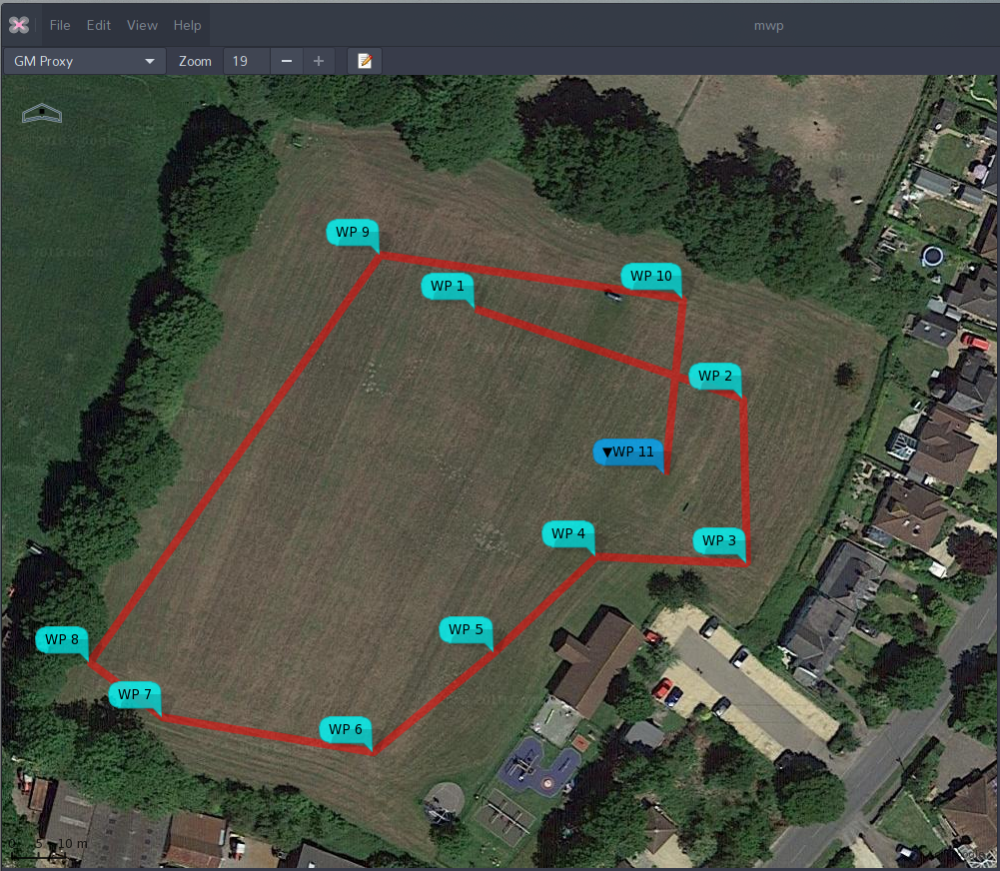
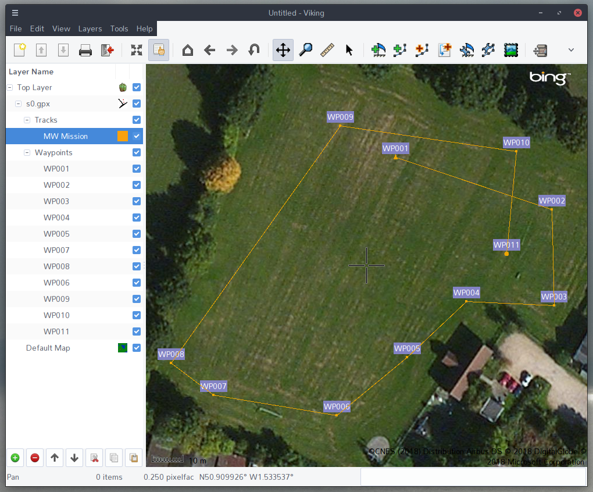
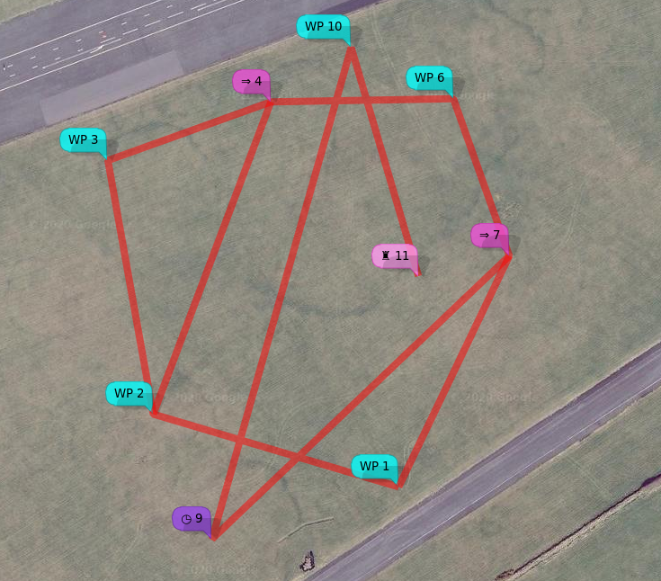

[impload](https://github.com/stronnag/impload), aka **inav Mission Plan Loader**, is a cross-platform, command line tool to upload missions in  a number of file formats to inav. It can also download missions and convert between file formats.

Mission File formats
====================

[impload](https://github.com/stronnag/impload) supports the following file formats:

-   **Multiwii XML**: (MWXML) The mission file format used by inav mission planners such as [mwp](https://github.com/stronnag/mwptools), ezgui, mission planner for inav and the inav configurator.

-   **APMPlanner2 text** files: Mission files generated by APMPlanner (and older qgroundcontrol); "QGC WPL 110" files.

-   **qgroundcontrol JSON Plan** files (recent versions of qgroundcontrol), simple mission and complex (survey).

-   **GPX**: A common format often used for GPS information. [impload](https://github.com/stronnag/impload) works with GPX files containing tracks, routes or waypoints.

-   **KML (and KMZ)**: Another common format; the export format for a number of well known tools like Google Earth. Mission should be defined as 'paths'.

-   **mwp JSON**: mission files.

-   **Simple CSV**: See below for detail

Use Cases
=========

-   Plan missions in apmplanner, (QGC WPL 110) upload (& save) to iNav

-   Plan missions in any GPX creating GIS tool

-   Plan missions in Google Earth, save as KML, upload to FC

-   Convert "alien" formats to MW-XML.

## Youtube tutorial

<iframe width="560" height="315" src="https://www.youtube.com/embed/Mktmk_Y6PhM" title="YouTube video player" frameborder="0" allow="accelerometer; autoplay; clipboard-write; encrypted-media; gyroscope; picture-in-picture" allowfullscreen></iframe>

Installation
============

From source: `go get github.com/stronnag/impload`, binaries endup in `go/bin`, source in `go/src/github.com/stronnag/impload`. Requires `go` and `git`.

Binaries in the Release area (linux ia32/x86\_64/arm7, Win32, MacOS, FreeBSD) if you don’t want it build it locally. The [release area](https://github.com/stronnag/impload/releases) provides
standalone binaries for ARM Linux (arm7), Linux on ia32 and x86\_64, MacOS, FreeBSD and Windows .

Usage
=====

Run the executable for your platform in a terminal (Windows `cmd` or `powershell`). The majority of the examples are from Linux where the serial device should be auto-detected; the examples are also relevant to MacOS and Windows, however you will need to specifically define the serial device, e.g. `-d COM7` on Windows, `-d /dev/tty.usbmodem14211` on MacO (where 14221 is possibly a random number).

```
$ impload -help
Usage of impload [options] command [files ...]
Options:
  -a int
    	Default altitude (m) (default 20)
  -b int
    	Baud rate (default 115200)
  -d string
    	Serial Device
  -fmt string
    	Output format (xml, json, cli, xml-ugly) (default "xml")
  -force-land
    	Adds RTH / Land for 'external' formats
  -force-rth
    	Adds RTH for 'external' formats
  -s float
    	Default speed (m/s)
  -v	Shows version
  command:
	Action required (upload|download|store|restore|convert|test|clear|erase|multi[=n])

impload v3.320.671, commit: c4c057e / 2021-11-16
```

Commands
--------

### upload

The upload command uploads the specified file as a waypoint mission to the flight controller.

### store

The store command uploads the specified file as a waypoint mission to the flight controller and then instructs inav to save the mission to
EEPROM.

### download

The download command downloads the waypoint mission in flight controller volatile memory to the specified file. The mission is always stored as an MW XML mission file.

### restore

The restore command instructs the flight controller to restore a mission previously saved to EEPROM into volatile memory, and then downloads the mission to a file (as for the download command).

### convert

The convert command converts the first file into an MW XML mission file with the second file name.

### test

The test command establishes communications with the flight controller and reports the FC name and build, as well as the contents of volatile mission memory.

### multi[=n]

Gets (`multi`) or sets (`multi=n`) the current active multi-mission Id.

Options
-------

Options start with a hyphen and must precede the command being run. On Linux, [impload](https://github.com/stronnag/impload) will attempt to access `/dev/ttyACM0` and `/dev/ttyUSB0`, so the device does not need to be specified if using these device nodes. On Windows and MacOS, it is
necessary to specify the device name / node.

-   `-d device` : define the device name

-   `-b baudrate` : define the baud rate (if not 115200 baud)

-   `-a default-altitude` : sets the default altitude unless it’s otherwise defined. MW XML mission files, apm mission files and CSV *may* define altitude values, so the default value given on the command line is only used for missing (zero) values. The value is in metres.

-   `-s default-speed` : defines the default speed. This is used where a leg speed is not set in the input mission file. MW XML mission file, mwp-json and QGC (apmplanner2, qgroundcontrol) are the only formats that specify a speed value. If not set, the mission is flown at the speed set in FC configuration.

-   `-force-rth` : For GPX only, adds RTH after the final waypoint.

-   `-force-land` : For GPX only, adds RTH with land after the final waypoint.

### Device Names

impload supports a subset of the mwp device naming scheme:

-   `serial_device[@baudrate]`

-   `tcp://host:port`

-   `udp://remotehost:remote_port`

-   `udp://local_host:local_port/remote_host:remote_port`

The baud rate given as an extended device name is preferred to -b

For ESP8288 transparent serial over UDP (the recommended mode for ESP8266), the latter form is required.

### Device Name examples

    /dev/ttyUSB0@57600
    /dev/ttyACM0
    COM17@115200
    tcp://esp8266:23
    udp://:14014/esp-air:14014
    # both sides use port 14014, remote (FC) is esp-air, blank local name is understood as INADDR_ANY.

Files
-----

The [impload](https://github.com/stronnag/impload) commands require zero, one or two file names. If file names are missing or are a single hyphen, then stdin (standard input) is used for readings and stdout (standard output) is used for writing. This allows pipelines to be used.

Usage Examples
==============

Convert a GPX track file to MW XML mission file
-----------------------------------------------

    $ impload convert test.gpx gpx_trk.mission

Store a apmplanner2 mission file to EEPROM
------------------------------------------

impload supports the following QGC WP types:

-   Waypoint (16)

-   Poshold\_time (19)

-   RTH (20)

-   Land (21)

-   Jump (177)

-   SET\_ROI (201)

-   DO\_SET\_ROI\_LOCATION (195)

-   DO\_SET\_ROI\_NONE (197)

-   DO\_CONDITION\_YAW (115)

with the following recommendations / restrictions:

-   Provide explicit positions rather that 'use previous' values

-   Jump to geo-referenced WPs

[Tabular list of WP types](https://github.com/stronnag/impload/wiki/QGC-WP-110-supported-WP-types) showing conversions and more detail on the ROI / YAW settings and restrictions.

    $ impload store samples/qpc_0.txt
    2018/05/24 18:09:10 Using device /dev/ttyUSB0 115200
    INAV v2.0.0 SPRACINGF3 (e7ca7944) API 2.2 "vtail"
    Waypoints: 0 of 60, valid 0
    upload 12, save true
    Saved Mission
    Waypoints: 12 of 60, valid 1

Upload a KML file to inav
-------------------------

    $ impload upload samples/google-earth-mission.kml
    2018/05/29 20:07:26 Using device /dev/ttyUSB0 115200
    INAV v2.0.0 SPRACINGF3 (6ccd0cc9) API 2.2 "vtail"
    Waypoints: 0 of 60, valid 0
    upload 9, save false
    Waypoints: 9 of 60, valid 1

Sample Images
-------------

Note that 'home' is notional in all cases, as we’re not at the field. It is not required by inav mission planners ([mwp](https://github.com/stronnag/mwptools), ezgui, mission planner for
inav et al).

### QGC Survey

Original survey plan:



In [mwp](https://github.com/stronnag/mwptools) after `impload convert`:



### Sample QGC in apmplanner2

Note that WP 0 is 'home' and doesn’t count; WP 12 indicates RTH.



### Sample QGC in apmplanner2



### Sample in [mwp](https://github.com/stronnag/mwptools)

The sample apm text file was uploaded to the FC, and downloaded into [mwp](https://github.com/stronnag/mwptools).



### Sample as GPX

The sample apm file as converted to an MW XML mission, then to a GPX
(using mwptools' [mission2gpx.rb](https://github.com/stronnag/mwptools/blob/master/samples/mission2gpx.rb)), then loaded into the FC. Somewhat contrived use case.



    $ impload convert samples/qpc_1.txt /tmp/qpc_1.mission
    $ mission2gpx.rb /tmp/qpc_1.mission /tmp/qpc_1_trk.gpx
    $ impload store tmp/qpc_1_trk.gpx

CSV Format
==========

[impload](https://github.com/stronnag/impload) can upload and convert missions defined by a simple CSV file. The header line **must** be present and must be one of:

    no,wp,lat,lon,alt,p1,p2

or

    wp,lat,lon,alt,p1,p2

i.e. the waypoint number is optional.

As of impload v3.021.370 (2021-01-21), impload supports all the inav 2.6 waypoint types, as either text or numeric values for CSV import.

Sample files:

    no,wp,lat,lon,alt,p1,p2
    1,WAYPOINT,54.353319318038153,-4.5179273723848077,35,0.0,0
    2,WAYPOINT,54.353572350395972,-4.5193913118652516,35,0.0,0
    3,WAYPOINT,54.354454163955907,-4.5196617811150759,50,0.0,0
    4,WAYPOINT,54.354657830207479,-4.5186895986330455,50,0.0,0
    5,JUMP,0,0,0,2,2
    6,WAYPOINT,54.354668848061756,-4.5176009696657218,35,0.0,0
    7,WAYPOINT,54.354122567317191,-4.5172673708680122,35,0.0,0
    8,JUMP,0,0,0,1,1
    9,POSHOLD_TIME,54.353138333126651,-4.5190405596657968,35,45,0.0
    10,WAYPOINT,54.354847022143616,-4.518210497615712,35,0.0,0
    11,LAND,54.354052100964488,-4.5178091504726012,60,0,0

and without numbers, and 'lazy' wp name and some numeric values.

    wp,lat,lon,alt,p1,p2
    WP,54.353319318038153,-4.5179273723848077,35,0.0,0
    WP,54.353572350395972,-4.5193913118652516,35,0.0,0
    WP,54.354454163955907,-4.5196617811150759,50,0.0,0
    WP,54.354657830207479,-4.5186895986330455,50,0.0,0
    JUMP,0,0,0,2,2
    WP,54.354668848061756,-4.5176009696657218,35,0.0,0
    WP,54.354122567317191,-4.5172673708680122,35,0.0,0
    6,0,0,0,1,1
    POSHOLD_TIME,54.353138333126651,-4.5190405596657968,35,45,0.0
    WP,54.354847022143616,-4.518210497615712,35,0.0,0
    8,54.354052100964488,-4.5178091504726012,60,0,0

Both result in the following XML mission file:

    <?xml version="1.0" encoding="utf-8"?>
    <mission>
      <!--Created by "impload" v2.087.278 on 2020-03-27T07:47:46Z
          <https://github.com/stronnag/impload>
      -->
      <version value="impload v2.087.278"/>
      <missionitem no="1" action="WAYPOINT" lat="54.35331931803815" lon="-4.517927372384808" alt="35" parameter1="0" parameter2="0" parameter3="0"/>
      <missionitem no="2" action="WAYPOINT" lat="54.35357235039597" lon="-4.519391311865252" alt="35" parameter1="0" parameter2="0" parameter3="0"/>
      <missionitem no="3" action="WAYPOINT" lat="54.35445416395591" lon="-4.519661781115076" alt="50" parameter1="0" parameter2="0" parameter3="0"/>
      <missionitem no="4" action="WAYPOINT" lat="54.35465783020748" lon="-4.5186895986330455" alt="50" parameter1="0" parameter2="0" parameter3="0"/>
      <missionitem no="5" action="JUMP" lat="0" lon="0" alt="0" parameter1="2" parameter2="2" parameter3="0"/>
      <missionitem no="6" action="WAYPOINT" lat="54.354668848061756" lon="-4.517600969665722" alt="35" parameter1="0" parameter2="0" parameter3="0"/>
      <missionitem no="7" action="WAYPOINT" lat="54.35412256731719" lon="-4.517267370868012" alt="35" parameter1="0" parameter2="0" parameter3="0"/>
      <missionitem no="8" action="JUMP" lat="0" lon="0" alt="0" parameter1="1" parameter2="1" parameter3="0"/>
      <missionitem no="9" action="POSHOLD_TIME" lat="54.35313833312665" lon="-4.519040559665797" alt="35" parameter1="45" parameter2="0" parameter3="0"/>
      <missionitem no="10" action="WAYPOINT" lat="54.354847022143616" lon="-4.518210497615712" alt="35" parameter1="0" parameter2="0" parameter3="0"/>
      <missionitem no="11" action="LAND" lat="54.35405210096449" lon="-4.517809150472601" alt="60" parameter1="0" parameter2="0" parameter3="0"/>
    </mission>

Note that `p1` (aka `parameter1` in MW XML) is the leg speed (m/s) for WAYPOINTs and the landing flag for RTH (1 = land). `alt` (altitude) is integer metres. These parameters (and others) are fully described in [the inav wiki](https://github.com/iNavFlight/inav/wiki/MSP-Navigation-Messages). There is also an animated preview of this mission [as a short youtube
video](https://youtu.be/MTA42WUOjUY).

CSV upload visualised in mwp
----------------------------



Note also
=========

-   impload enforces [inav mission sanity rules](https://github.com/iNavFlight/inav/wiki/MSP-Navigation-Messages).

Postscript
==========

The author knows how to spell "implode".
